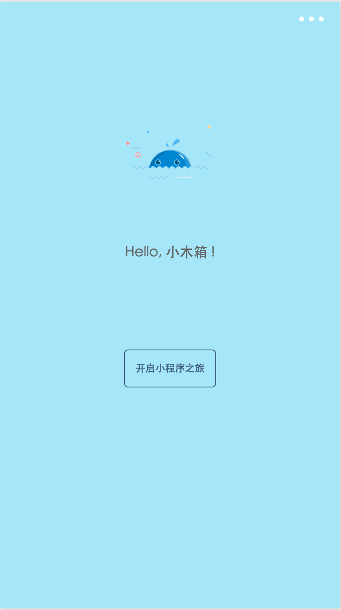
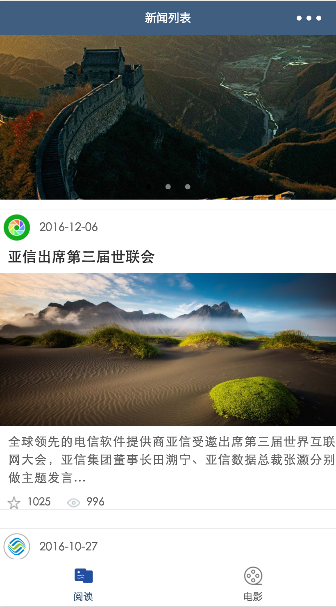
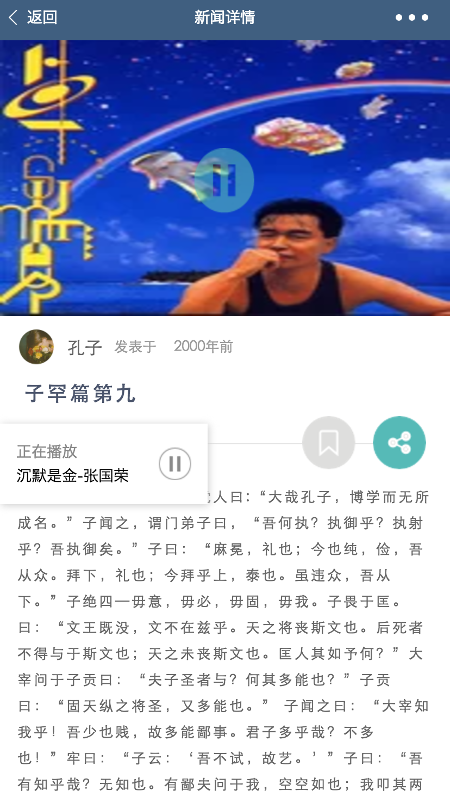
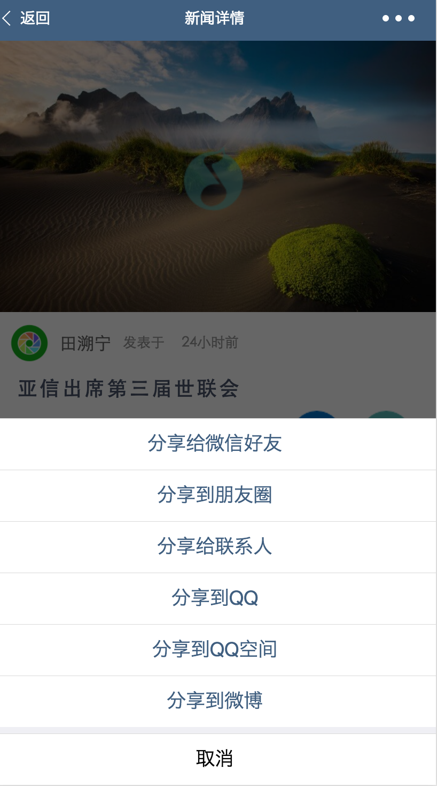
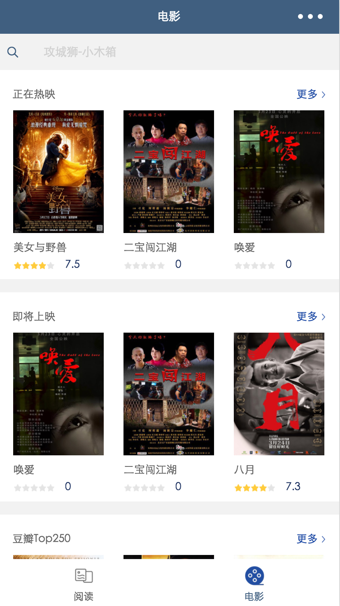
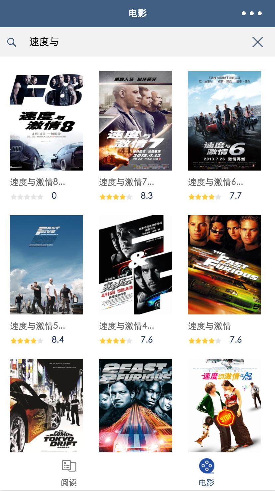
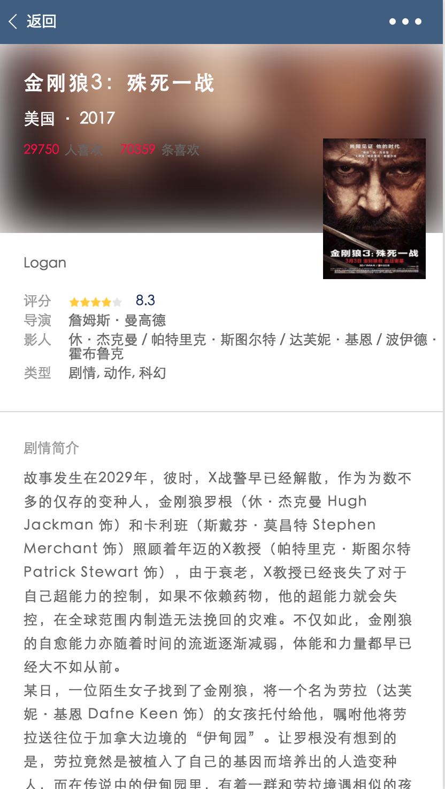

# 微信小程序
> 小程序的四大特征：无需下载、触手可及、随用随走、无需卸载。

## 项目目标
 最大程度的解决小程序爱好者从0基础到入门,小程序入门需要有JS,CSS3 FlexBox和ES6基础,想尽早尝试小程序的小伙伴们赶紧下手学习基础语法吧

## 特点
 小程序适用于低频应用,应用简单,用完即走,性能要求低的开发,类似于一些推送,嵌webview,视频直播和手机游戏应用,小程序还没有那么大的能耐哦!

## 开发环境
官方推荐IDEA:web开发者工具,小编推荐Egret Wing3

非常感谢 小楼昨夜又秋分 微信小程序教学资源支持

## 效果图

so,看一下实现效果图吧!

  

  

